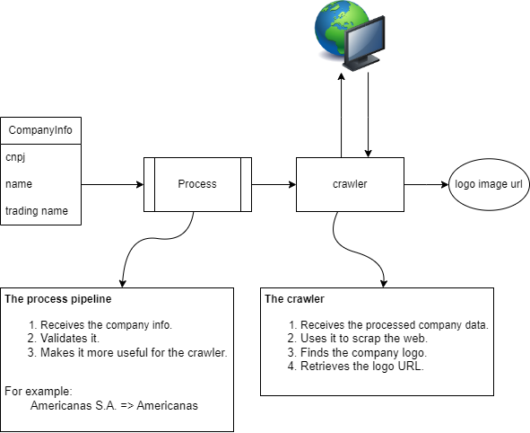

# Logofinder

TLDR: This projects implements webcrawlers that search for companies logos.

## Explanation

The system has two main parts: processing and crawling.

The processing is responsible for cleaning up the data, making the crawler search more assertive. That said, the `CompanyDataProcessor` class is the protocol class that represents the processors expected behavior. Each processor should take a `CompanyInfo` list as argument, validates its data and process it.

Each crawler receives the processed data and uses it for finding the company logo. It is important to note that a crawler expects a specific kind of data (like company name) so you need to choose a processor that outputs this kind of data. Each crawler implements an property which returns a default processor for the crawler.